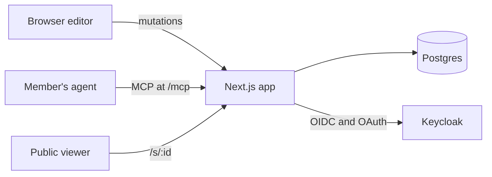

# Plan

PLAN.md is the design document. Work items live in [GitHub issues](https://github.com/zyx1121/slide/issues), and each sprint is a milestone.

## Goal

WinLab members build and tweak lab decks in the browser instead of opening PowerPoint. They point at a slide, a line of text, a picture, or a connector, and tell their own agent what to change over MCP. A deck can be exported to `.pptx` and published to a public URL.

## Decisions

Made on 2026-10-03.

| Topic           | Decision                                                                                                                                                                                                                                                                                                                                                                                          |
| --------------- | ------------------------------------------------------------------------------------------------------------------------------------------------------------------------------------------------------------------------------------------------------------------------------------------------------------------------------------------------------------------------------------------------- |
| Repo            | `zyx1121/slide` (renamed from `zyx1121/slide.winlab.tw` on 2026-10-04), public, MIT                                                                                                                                                                                                                                                                                                               |
| Sign-in         | Keycloak for both the web app and MCP. WinLab's instance uses `auth.winlab.tw`, realm `winlab`                                                                                                                                                                                                                                                                                                    |
| Access          | A member reads and edits only their own decks. Sharing comes later. Every account in the Keycloak realm may sign in: WinLab's realm holds only lab members, so there is no group check                                                                                                                                                                                                            |
| Home page       | Create a blank deck, or upload a `.pptx` (v0.2: a deck picks its template)                                                                                                                                                                                                                                                                                                                        |
| Runtime         | Two services in Docker Compose: the Next.js app and Postgres                                                                                                                                                                                                                                                                                                                                      |
| Editing model   | Free placement. Only the title and the page number come from the template; everything else is shapes the member places                                                                                                                                                                                                                                                                            |
| Source of truth | A JSON shape model in Postgres. Its fields follow DrawingML (preset geometry, transform, connector sites), so `.pptx` export and import map one to one                                                                                                                                                                                                                                            |
| Design          | The ui.zyx.tw design contract through the task-web shell: four fixed corners (zyx mark, page actions, Privacy and Terms, copyright), one centered column, the editor as the central workspace. Only 24, 16 and 14 px type; Inter, Noto Sans JP/TC, Geist Mono for code; dark first with `d` for light; stock shadcn base-nova components and the `@zyx1121/theme` registry item; grayscale chrome |

## Architecture

Two blocks, one document model, five rules.

The Next.js app holds the editor, the MCP endpoint, the public pages, `.pptx` import and export, and the renderer.

### Data

| Record    | Fields                                                                                                                                                                                                                                                                                                                                                                                                                                                                                                                 |
| --------- | ---------------------------------------------------------------------------------------------------------------------------------------------------------------------------------------------------------------------------------------------------------------------------------------------------------------------------------------------------------------------------------------------------------------------------------------------------------------------------------------------------------------------- |
| deck      | owner, title (mirrors the document's), published flag, random public id, version, document                                                                                                                                                                                                                                                                                                                                                                                                                             |
| document  | a title and slides; each slide has a title (template placeholder) and shapes, back to front. A shape has a stable id, a kind (`rect`, `roundRect`, `ellipse`, `preset` for other PowerPoint presets, `freeform` for a custom outline, `text`, `line`, `image`), a box (x, y, w, h, rotation) in px on a 1920 x 1080 canvas, fill and stroke, and text as paragraphs of runs. A connector has a route (`straight`, `elbow`, `curved`) and two ends, each a point or a shape and site (0 top, 1 left, 2 bottom, 3 right) |
| revision  | deck, base version, the version it produced, author (member or agent), status (`applied`, `suggested`, `rejected`), a JSON Patch and its inverse                                                                                                                                                                                                                                                                                                                                                                       |
| selection | one per member: deck, slide, targets (shape id, optional text range)                                                                                                                                                                                                                                                                                                                                                                                                                                                   |
| asset     | image bytes, stored once by sha256 on a volume; PNG, JPEG or GIF up to 10 MB, checked by their bytes. Every member who uploads the same bytes owns them, and only owners may read them or have them drawn                                                                                                                                                                                                                                                                                                              |

### Rules

1. Every write, from the editor or from MCP, goes through one mutation path: validate against the schema, check the base version, store a revision.
2. Agent writes land as suggestions. The member accepts or rejects each one in the editor, and any applied revision can be reverted on its own.
3. A shape keeps its id for life. Tools address shapes by id, never by position. The editor's patches address positions, so each carries RFC 6902 `test` operations on the ids it touches and is refused whole if they no longer match. Patches may use add, remove, replace, move and test; copy is refused, since it could double the document with every operation.
4. One renderer: the document renders to SVG for the editor, the public page, and MCP snapshots (rasterized to PNG on the server). Text is laid out by our own line breaker with bundled font files, so the browser and the server wrap lines the same way.
5. A connector stores which shape and site each end attaches to. Its geometry is recomputed whenever either end moves, and export writes the routed geometry, because PowerPoint draws the stored geometry until a shape moves.

### Rendering

One renderer turns a slide into SVG (`lib/render`), and the server rasterizes the same SVG with resvg. A template with a background (the WinLab master's gradient, logo, title rule and footer bar) has it as a 3840 x 2160 image rendered once from its `.pptx`; the title and the slide number are drawn as text in the master's placeholder boxes, which every template shares. Text is laid out by our own engine: Carlito's advance widths (Calibri's metrics) for Latin, one em for CJK, kinsoku for CJK punctuation, PowerPoint's default insets, bullets and single line spacing (1.2207). Every run is placed with `textLength`, and runs split where the script changes so each is drawn in one font, so the browser and resvg draw the same lines. Elbow connectors leave and enter perpendicular to the shape's side with the fewest bends the ends allow.

Text is edited where it is drawn. The renderer draws the draft as it is typed, and the editor draws the caret and the selection from the same layout, so a line wraps while typing exactly where it is stored and exported. Keys, IME composition and the clipboard go through a hidden field kept at the caret, which also opens the IME's candidate window there. Typing is saved as one edit when it pauses and when editing ends; a text box without fill or outline grows and shrinks with its text, and one left empty is deleted, as in PowerPoint.

### MCP tools

| Tool                                           | Does                                                                 |
| ---------------------------------------------- | -------------------------------------------------------------------- |
| `list_decks`, `get_deck`                       | read the member's decks                                              |
| `render_slide`                                 | return a slide as PNG so the agent can check its own work            |
| `get_selection`                                | return what the member selected: targets, their JSON, and a PNG crop |
| `add_shapes`, `update_shapes`, `delete_shapes` | edit shapes, as suggestions                                          |
| `add_slide`, `delete_slide`, `move_slide`      | edit slides, as suggestions                                          |
| `check_deck`                                   | return rule violations with slide and shape ids                      |

### Rule check

`check_deck` and the editor panel share one rule set: font size bounds, palette, text overflow, overlapping text, connectors crossing text, low contrast. The rules come from the WinLab slide guidelines and the QA checklist in `zyx1121/plugin` `skills/winlab-pptx`.

## Scope of v0.1

1. Editor: shapes, glued connectors, text, images, and basic operations (drag, snap, multi-select, copy and paste, undo, z-order)
2. Selection for agents
3. Rule check
4. Suggestion mode and version history
5. `.pptx` export and import, publish to a public URL

Later: comments for agents, drafts from sources (paper PDF, transcript, README), a diagram library, live agent presence, shared decks, tables, groups, freeform shapes.

Out of scope: animation, equations, charts, SmartArt, audio and video.

## v0.2: Slide on its own

Decided on 2026-10-04: Slide stops depending on WinLab and runs at `slide.zyx.tw`. Sprint 4 tracks the work.

| Topic       | Decision                                                                                   |
| ----------- | ------------------------------------------------------------------------------------------ |
| Name        | Slide: repo `zyx1121/slide`, image `ghcr.io/zyx1121/slide`                                 |
| Sign-in     | Google through Better Auth, replacing Keycloak                                             |
| Access      | Only allowlisted, verified email addresses may sign in                                     |
| MCP         | Slide is its own authorization server for `/mcp` instead of relaying Keycloak              |
| Templates   | A deck picks a template. New decks use a neutral one; the WinLab master stays as an option |
| Old address | `slide.winlab.tw` goes offline without a redirect; its public links stop working           |

## Evidence

Feature inventory of 12 hand-made decks, 876 slides in total: 1,033 text boxes, 665 pictures, 564 rounded rectangles, 275 connectors (141 glued to shapes), 267 arrowheads, 181 dashed lines, 16 tables, 7 groups, 18 freeforms, and no charts, SmartArt, or media. Animation and equations appeared only in course decks.

Glued connectors: a demo built with python-pptx, with the elbow geometry precomputed (`bentConnector2`, `rot="16200000" flipH="1"`), opened correctly in PowerPoint before any shape moved. LibreOffice reroutes connectors on open, so it cannot verify connector geometry.

## Risks

- Text layout parity with PowerPoint. Carlito matches Calibri's metrics; CJK fonts differ, so CJK lines may wrap slightly differently.
- IME composition while editing text on the canvas.
- MCP sign-in through Keycloak, including the client registration policy.
- `.pptx` import fidelity. Unsupported elements become pictures or are skipped, with a report.
