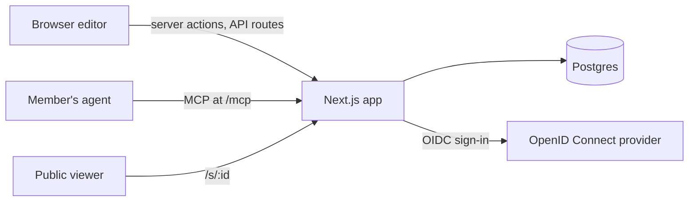

# Plan

PLAN.md is the design document. Work items live in [GitHub issues](https://github.com/zyx1121/slide/issues), and each sprint is a milestone.

## Goal

Members build and tweak decks in the browser instead of opening PowerPoint, and hand the editing to their own agent over MCP: they point at a slide, a line of text, a picture or a connector and say what to change, and the agent changes it. The web app helps them look, point, comment and present; whatever it can do, an agent can do too. A deck can be exported to `.pptx` and published to a public URL.

## Decisions

| Topic           | Decision                                                                                                                                                                                                                                                                                                                                                                                          |
| --------------- | ------------------------------------------------------------------------------------------------------------------------------------------------------------------------------------------------------------------------------------------------------------------------------------------------------------------------------------------------------------------------------------------------- |
| Repo            | `zyx1121/slide` (renamed from `zyx1121/slide.winlab.tw` on 2026-10-04), public, MIT; image `ghcr.io/zyx1121/slide`                                                                                                                                                                                                                                                                                |
| Sign-in         | Any OpenID Connect provider (a confidential client with PKCE S256), behind `ALLOWED_EMAILS`: only verified addresses on the list get in, checked again on every request                                                                                                                                                                                                                           |
| Access          | A member reads and edits only their own decks and pictures. Sharing comes later                                                                                                                                                                                                                                                                                                                   |
| Agents          | MCP at `/mcp`, with the app as its own OAuth authorization server. Whatever a member can do in the web app, an agent can do over MCP. An agent's changes apply at once, like the member's: there is nothing to accept. The history takes any edit back; publishing and deleting are undone by their opposite                                                                                      |
| Runtime         | Two services in Docker Compose: the Next.js app and Postgres, from one image that also runs the migrations                                                                                                                                                                                                                                                                                        |
| Editing model   | Free placement. Only the background, the title and the page number come from the template; everything else is shapes the member places. A deck picks its template: plain (the default) or the WinLab master                                                                                                                                                                                       |
| Source of truth | A JSON shape model in Postgres. Its fields follow DrawingML (preset geometry, transform, connector sites), so `.pptx` export and import map one to one                                                                                                                                                                                                                                            |
| Design          | The ui.zyx.tw design contract through the task-web shell: four fixed corners (zyx mark, page actions, Privacy and Terms, copyright), one centered column, the editor as the central workspace. Only 24, 16 and 14 px type; Inter, Noto Sans JP/TC, Geist Mono for code; dark first with `d` for light; stock shadcn base-nova components and the `@zyx1121/theme` registry item; grayscale chrome |

## Architecture

One app, one database, one document model, five rules.

The Next.js app holds the editor, the presenter view, the MCP endpoint and its authorization server, the public pages, `.pptx` import and export, and the renderer.

### Data

| Record    | Fields                                                                                                                                                                                                                                                                                                                                                                                                                                                                                                                                            |
| --------- | ------------------------------------------------------------------------------------------------------------------------------------------------------------------------------------------------------------------------------------------------------------------------------------------------------------------------------------------------------------------------------------------------------------------------------------------------------------------------------------------------------------------------------------------------- |
| deck      | owner, title (mirrors the document's), published flag, random public id, version, when it was deleted (deleting keeps it, restorable), document                                                                                                                                                                                                                                                                                                                                                                                                   |
| document  | a title, a template and slides; each slide has a title (template placeholder), speaker notes and shapes, back to front. A shape has a stable id, a kind (`rect`, `roundRect`, `ellipse`, `preset` for other PowerPoint presets, `freeform` for a custom outline, `text`, `line`, `image`), a box (x, y, w, h, rotation) in px on a 1920 x 1080 canvas, fill and stroke, and text as paragraphs of runs. A connector has a route (`straight`, `elbow`, `curved`) and two ends, each a point or a shape and site (0 top, 1 left, 2 bottom, 3 right) |
| revision  | deck, base version, the version it produced, author (member or agent), kind (`edit`, `publish`, `unpublish`, `delete`, `restore`), status (`applied`; `rejected` for suggestions from before agents' changes applied at once), a JSON Patch and its inverse                                                                                                                                                                                                                                                                                       |
| comment   | rows kept for good: a comment on a selection (slides, shapes, words), and the replies, resolves and reopens of its thread                                                                                                                                                                                                                                                                                                                                                                                                                         |
| selection | one per member: deck, slide, targets (shape id, optional text range)                                                                                                                                                                                                                                                                                                                                                                                                                                                                              |
| asset     | image bytes, stored once by sha256 on a volume; PNG, JPEG or GIF up to 10 MB, checked by their bytes. Every member who uploads the same bytes owns them, and only owners may read them or have them drawn                                                                                                                                                                                                                                                                                                                                         |
| MCP grant | one-time authorization codes and refresh tokens, stored as sha256. A refresh token is replaced on every use; one sent once more within 60 s counts as a retry, and one sent again after that retry, later (within a day, while it is kept), by another client, or for a member no longer on the allowlist revokes its whole family. The allowlist is checked against the email the provider gave at the member's last sign-in, so an address changed at the provider counts only from the next sign-in                                            |

### Rules

1. A document changes only once `applyOperations` has validated the patch and the result against the schema, and every change is stored as a revision with its inverse. Saves, agents' edits and renames go through `mutateDeck` (`lib/deck/store.ts`): the editor's saves are written against a base version and refused as a conflict when the deck moved on; agents' edits and renames are planned on the deck as it is while its row is held, so they never conflict. Reverts, and the deck actions (publish, unpublish, delete, restore), are written by `lib/deck/revisions.ts`.
2. An agent's writes apply at once, like the member's. Every change is a revision; any edit can be reverted on its own unless a later edit changed the same place, and publishing, unpublishing, deleting and restoring are undone by their opposite.
3. A shape keeps its id for life. Tools address shapes by id, never by position. The editor's patches address positions, so each carries RFC 6902 `test` operations on the ids it touches and is refused whole if they no longer match. Patches may use add, remove, replace, move and test; copy is refused, since it could double the document with every operation.
4. One renderer: the document renders to SVG for the editor, the presenter view, the public page, and MCP snapshots (rasterized to PNG on the server). Text is laid out by our own line breaker with bundled font files, so the browser and the server wrap lines the same way.
5. A connector stores which shape and site each end attaches to. Its geometry is recomputed whenever either end moves, and export writes the routed geometry, because PowerPoint draws the stored geometry until a shape moves.

### Rendering

One renderer turns a slide into SVG (`lib/render`), and the server rasterizes the same SVG with resvg. A template with a background (the WinLab master's gradient, logo, title rule and footer bar) has it as a 3840 x 2160 image rendered once from its `.pptx`; the title and the slide number are drawn as text in the master's placeholder boxes, which every template shares. Text is laid out by our own engine: Carlito's advance widths (Calibri's metrics) for Latin, one em for CJK, kinsoku for CJK punctuation, PowerPoint's default insets, bullets and line spacing. Every run is placed with `textLength`, and runs split where the script changes so each is drawn in one font, so the browser and resvg draw the same lines. Elbow connectors leave and enter perpendicular to the shape's side with the fewest bends the ends allow.

Text is edited where it is drawn. The renderer draws the draft as it is typed, and the editor draws the caret and the selection from the same layout, so a line wraps while typing exactly where it is stored and exported. Keys, IME composition and the clipboard go through a hidden field kept at the caret, which also opens the IME's candidate window there. Typing is saved as one edit when it pauses and when editing ends; a text box without fill or outline grows and shrinks with its text, and one left empty is deleted, as in PowerPoint.

### Saving

The editor applies an edit at once and saves it in the background, one at a time (`lib/editor/saver.ts`). When a save meets a deck that moved on (the member's agent edited it), the editor loads the deck and replays the edits still waiting on it, each re-pointed at the ids its tests name (`lib/editor/retarget.ts`), without ending the text being typed. When any of them no longer fits (what it changed is gone), all the edits waiting, and any text being typed, are dropped and the deck is shown as it is, with a notice; text being typed in a box that was deleted ends with a notice of its own. Saves go on after leaving the editor for another page of the app, and closing the tab with edits unsaved asks first. While the tab is visible and the member is between edits, changes made elsewhere come in within 3 s, along with publishing and deleting.

### Agents

`lib/mcp/server.ts` holds the tools, and `lib/mcp/parity.ts` maps every server action and API route to the tools that do the same; a test fails when one is missing. The kinds of edit the editor saves through one action are matched by hand: shapes, slides, slide titles and notes, the deck's title and template.

| In the web app                                   | Over MCP                                                                                                                                                                                                                |
| ------------------------------------------------ | ----------------------------------------------------------------------------------------------------------------------------------------------------------------------------------------------------------------------- |
| Create, import, rename, delete, restore          | `create_deck`, `import_deck`, `rename_deck`, `delete_deck`, `restore_deck`, `list_decks`                                                                                                                                |
| Edit shapes, slides, titles, notes and templates | `add_shapes`, `update_shapes`, `delete_shapes`, `add_slide`, `copy_slide`, `delete_slide`, `move_slide`, `set_slide_title`, `set_slide_notes`, `set_template`                                                           |
| Pictures                                         | `upload_image`, `get_image`                                                                                                                                                                                             |
| Download, publish                                | `export_deck`, `publish_deck`, `unpublish_deck`                                                                                                                                                                         |
| History                                          | `list_history`, `revert`                                                                                                                                                                                                |
| Look and point                                   | `get_deck`; `render_slide`, a PNG of a slide for the agent to check its own work; `check_deck`, rule violations with slide and shape ids; `get_selection`, what the member selected: targets, their JSON and a PNG crop |
| Comment on a selection, reply, resolve           | `list_comments`, `add_comment`, `reply_comment`, `resolve_comment`, `reopen_comment`                                                                                                                                    |

A member comments on what they select, as many comments as they like. The agent reads the open threads, answers each with edits, replies naming the entry that answers it, and resolves the thread.

`check_deck` gives an agent its one deterministic check: font size bounds, the template's palette, text and titles overflowing, overlapping text, connectors crossing text, low contrast, shapes off the slide. The rules come from the WinLab slide guidelines and the QA checklist in `zyx1121/plugin` `skills/winlab-pptx`.

### Presenting

Presenting needs no server state. 播放 shows the slides full screen over the editor. 簡報者模式 opens a projection window (only the slide, on black) and turns the tab into the presenter view: the slide shown and the next, the speaker notes below them, a timer and the clock. The presenter view decides what shows and tells the projection windows over a `BroadcastChannel` named for the deck (`lib/present/control.ts`); keys pressed in a projection window go back to it, so a clicker works in either window. Each projection keeps every slide drawn with the template background on its frame, so changing slides never decodes the background again. A deck changed elsewhere comes in through the presenter view's own 3 second check, as in the editor, and stays on the same slide by id. Where the browser can place windows (Chromium's Window Management API) the projection window opens on the other screen; elsewhere it is dragged there.

## How it got here

All on 2026-10-03 and 2026-10-04.

1. The editor (shapes, glued connectors, text, images, undo, copy and paste), selection for agents, the rule check, the history, `.pptx` import and export, and public links, for WinLab members at `slide.winlab.tw`, signed in through WinLab's Keycloak.
2. Slide on its own at `slide.zyx.tw`: sign-in through any OpenID Connect provider behind an allowlist, its own MCP authorization server, templates per deck; `slide.winlab.tw` went offline without a redirect.
3. Agents can do everything a member can, comments on selections, and agents' changes applying at once instead of waiting as suggestions.
4. Speaker notes and presenting.
5. A review for what was not needed: fewer dock tools, deck actions undone by their opposite rather than by revert, unused code and columns removed, agents' edits planned while the deck is held.

## Scope

Later: drafts from sources (paper PDF, transcript, README), a diagram library, live agent presence, shared decks, tables, groups.

Out of scope: animation, equations, charts, SmartArt, audio and video.

## Evidence

Feature inventory of 12 hand-made decks, 876 slides in total: 1,033 text boxes, 665 pictures, 564 rounded rectangles, 275 connectors (141 glued to shapes), 267 arrowheads, 181 dashed lines, 16 tables, 7 groups, 18 freeforms, and no charts, SmartArt, or media. Animation and equations appeared only in course decks.

Glued connectors: a demo built with python-pptx, with the elbow geometry precomputed (`bentConnector2`, `rot="16200000" flipH="1"`), opened correctly in PowerPoint before any shape moved. LibreOffice reroutes connectors on open, so it cannot verify connector geometry.

## Risks

- Text layout parity with PowerPoint. Carlito matches Calibri's metrics; CJK fonts differ, so CJK lines may wrap slightly differently.
- IME composition while editing text on the canvas.
- MCP sign-in: Slide is the authorization server; clients are known by their metadata document or limited to loopback redirects.
- `.pptx` import fidelity. Unsupported elements become pictures or are skipped, with a report.
