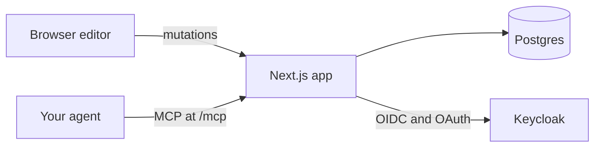

```
███████╗██╗     ██╗██████╗ ███████╗
██╔════╝██║     ██║██╔══██╗██╔════╝
███████╗██║     ██║██║  ██║█████╗
╚════██║██║     ██║██║  ██║██╔══╝
███████║███████╗██║██████╔╝███████╗
╚══════╝╚══════╝╚═╝╚═════╝ ╚══════╝
```

# slide

> Lab decks in the browser: draw, point at a shape, and let your agent edit it over MCP.

`slides` · `mcp` · `docker` · `pptx`

[](#license)

WinLab members draw their slides by hand in PowerPoint: rounded rectangles, connectors glued to them, text boxes placed wherever they fit. Asking an AI to change one box means first describing where that box is. slide keeps those drawing tools in the browser, lets you select a shape and tell your agent what to change, and still exports a normal `.pptx` when someone needs one.

> [!IMPORTANT]
> Status: in design. The plan is in [PLAN.md](PLAN.md); Deploy, Use, and Configure arrive with v0.1.0.

## What it does

- **Draws** rounded rectangles, text, pictures, and connectors that stay glued when shapes move
- **Shows your agent what you selected**: a slide, a line of text, a picture, or a connector
- **Suggests, then applies**: agent edits wait for your accept, and any change can be reverted
- **Checks** a deck against the lab's slide rules
- **Exports** to `.pptx` and **publishes** a deck to a public URL

## How it works



One Next.js app and one Postgres database, run with Docker Compose. Every edit, from the editor or from an agent, goes through the same validated path and is stored as a revision. Members sign in with Keycloak, and each member sees only their own decks.

## Develop

```sh
bun install
sh scripts/fetch-fonts.sh   # Carlito and Noto Sans TC, for slide rendering
cp .env.example .env   # set DATABASE_URL to a Postgres you can reach
bun run migrate
bun dev
```

CI runs `bun run typecheck`, `bun run lint`, `bun run format:check`, and `bun run test`, then builds the image and smoke-tests the compose stack with [scripts/smoke.sh](scripts/smoke.sh).

## Contributing

Issues and PRs welcome: start with [CONTRIBUTING.md](https://github.com/zyx1121/.github/blob/main/CONTRIBUTING.md).

## License

[MIT](LICENSE) · every connector stays glued
