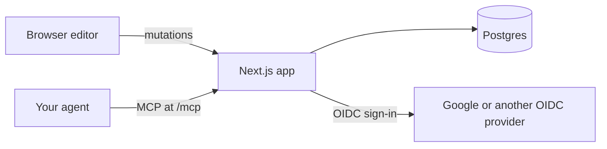

```
███████╗██╗     ██╗██████╗ ███████╗
██╔════╝██║     ██║██╔══██╗██╔════╝
███████╗██║     ██║██║  ██║█████╗
╚════██║██║     ██║██║  ██║██╔══╝
███████║███████╗██║██████╔╝███████╗
╚══════╝╚══════╝╚═╝╚═════╝ ╚══════╝
```

# slide

> Slide decks in the browser: draw, point at a shape, and let your agent edit it over MCP.

`slides` · `mcp` · `docker` · `pptx`

[](https://github.com/zyx1121/slide/actions) &nbsp;[](https://github.com/zyx1121/slide/pkgs/container/slide) &nbsp;[](#license)

Many people draw their slides by hand in PowerPoint: rounded rectangles, connectors glued to them, text boxes placed wherever they fit. Asking an AI to change one box means first describing where that box is. slide keeps those drawing tools in the browser, lets you select a shape and tell your agent what to change, and still exports a normal `.pptx` when someone needs one.

```
> "Make the hi on slide 1 say Results, 24 pt bold"
  ⚡ get_deck { deck_id: "dk_a9q86y45ax" }
  ⚡ update_shapes { deck_id: "dk_a9q86y45ax", slide: 1, updates: [{ id: "sh_hdq4vujt", set: { text: { paragraphs: [{ runs: [{ text: "Results", size: 48, bold: true }], align: "center" }] } } }] }
✓ { status: "applied", entry: "42", changed: ["sh_hdq4vujt"] }: done; the editor shows it, and the history can revert it
```

## What it does

- **Draws** rectangles, rounded rectangles, ellipses, text boxes, pictures, and connectors that stay glued when shapes move, with undo, copy and paste
- **Types** in place, Chinese input methods included, wrapping lines exactly where PowerPoint does
- **Hands your agent** what you selected over MCP: the shapes as JSON, the words you marked, and a picture of that part of the slide
- **Lets your agent edit directly**: its changes apply at once, like yours, and every one is recorded in the history, where any edit can be reverted on its own
- **Imports and exports** `.pptx`, keeping shapes native, connectors glued and text editable
- **Presents** full screen, or split across screens: the projector shows only the slides while your screen shows the slide, the next one, your speaker notes (written in the editor or by your agent) and a timer
- **Publishes** a deck to a read-only link anyone can open and download
- **Checks** a deck for your agent (`check_deck`): text sizes, overflow, overlaps, contrast, and the template's palette

## Deploy

With Docker Compose, on any machine with Docker:

```sh
curl -fsSLO https://raw.githubusercontent.com/zyx1121/slide/main/compose.yaml
curl -fsSL -o .env https://raw.githubusercontent.com/zyx1121/slide/main/.env.example
# set POSTGRES_PASSWORD, APP_URL, OIDC_*, ALLOWED_EMAILS and SESSION_SECRET in .env
docker compose up -d
```

This starts Postgres, a one-shot migration job and the web app, all from `ghcr.io/zyx1121/slide`, with the app on `127.0.0.1:3000`. Uploaded pictures live on the `assets` volume; back it up with the database.

> [!IMPORTANT]
> The app listens on 127.0.0.1 and speaks plain HTTP: put a reverse proxy with TLS in front (it must pass the original `Host`), and register `APP_URL/auth/callback` as a redirect URI of your sign-in client. Let the proxy refuse request bodies a little over 100 MiB, the largest upload (a `.pptx` import); in Caddy, `request_body { max_size 101MiB }` (Caddy reads `MB` as 1,000,000 bytes).

## Use

1. Sign in with an account whose email is in `ALLOWED_EMAILS` (Google, or any OpenID Connect provider you configure). The home page lists your decks: **新增** starts a blank one, **匯入** turns a `.pptx` into one.
2. Edit on the slide. Double-click a shape or the title to type; the dock at the bottom inserts shapes, text boxes, pictures and connectors, and a menu next to what you select styles it.
3. Connect your agent. In Claude Code, run `claude mcp add --transport http slide https://slide.example.org/mcp`, then sign in from `/mcp`; it signs you in (if you are not already) and asks you to allow the agent.
4. Select shapes (or words) and leave a comment from the dock's 評論 button, as many as you like; then ask your agent to answer the open comments. Or select shapes and ask your agent to change them directly. Its edits show up at once; the history button in the dock (**紀錄**) lists every change, yours and your agent's, and reverts any edit.
5. Download a `.pptx` from the dock, or publish the deck from the globe button and share its `/s/…` link.

## Configure

Set these in `.env`; [.env.example](.env.example) documents every one.

| Key                                                         | What it sets                                                            | Default             |
| ----------------------------------------------------------- | ----------------------------------------------------------------------- | ------------------- |
| `POSTGRES_PASSWORD`                                         | the bundled Postgres password                                           | required            |
| `APP_URL`                                                   | the public URL members open; the sign-in provider sends them back there | required            |
| `OIDC_ISSUER`                                               | the OpenID Connect provider, e.g. `https://accounts.google.com`         | required            |
| `OIDC_CLIENT_ID`                                            | a confidential web client using the code flow with PKCE S256            | required            |
| `OIDC_CLIENT_SECRET`                                        | that client's secret                                                    | required            |
| `ALLOWED_EMAILS`                                            | comma-separated verified email addresses that may sign in               | required            |
| `SESSION_SECRET`                                            | encrypts the session cookie, 32 characters or more                      | required            |
| `OTEL_EXPORTER_OTLP_ENDPOINT`, `OTEL_EXPORTER_OTLP_HEADERS` | where traces and error logs go, over OTLP/HTTP JSON                     | off                 |
| `OTEL_SERVICE_NAME`                                         | the service name on those traces                                        | `slide`             |
| `ASSETS_DIR`                                                | where a run from source keeps uploaded pictures (compose uses a volume) | `./data/assets`     |
| `MIGRATIONS_DIR`                                            | where the migrate role reads its SQL files                              | `./migrations`      |
| `SLIDE_VERSION`                                             | the image tag compose runs                                              | `latest`            |
| `SLIDE_BIND`, `SLIDE_PORT`                                  | where the web port is published                                         | `127.0.0.1`, `3000` |

## How it works



One Next.js app and one Postgres database, run with Docker Compose. Members sign in with an OpenID Connect provider such as Google, and only verified emails in `ALLOWED_EMAILS` get in; each member sees only their own decks and pictures; a published deck is readable by anyone with its link until it is unpublished. An agent signs in through the app's own OAuth authorization server: the member signs in as on the web, allows the agent on a consent page, and the agent gets a one-hour access token and a rotating refresh token, stored only as hashes; `/mcp` acts as that member while the grant stands and the member stays on the allowlist. Every edit, from the editor or from an agent, goes through the same validated path and is stored as a revision; an agent's edit applies at once like the member's, and any edit can be reverted on its own. One renderer draws slides in the browser and, through resvg, on the server, with bundled fonts, so lines wrap the same everywhere.

## Develop

```sh
bun install
sh scripts/fetch-fonts.sh   # Carlito, Noto Sans TC and Noto Emoji, for slide rendering
cp .env.example .env   # set DATABASE_URL to a Postgres you can reach
bun run migrate
bun dev
```

CI runs `bun run typecheck`, `bun run lint`, `bun run format:check`, and `bun run test`, then builds the image and smoke-tests the compose stack with [scripts/smoke.sh](scripts/smoke.sh).

## Limitations

- Slides use one of two templates, plain or WinLab; an imported deck keeps its shapes, not its own master
- Import turns a table into a rectangle per cell (its text stays editable, but not as one table), and leaves out charts, SmartArt, freeforms drawn with guide formulas, and pictures in EMF, SVG or TIFF, and says so
- Pictures are PNG, JPEG or GIF, up to 10 MB and 50 million pixels
- Text is capped at 5,000 characters a shape and 20,000 a slide, so any slide renders in a second or two
- Decks are private to their owner; sharing with other members is not there yet
- In Safari and Firefox the projection window cannot place itself on the projector: drag it there, then double-click it to go full screen (Chromium browsers open it on the other screen)

## Contributing

Issues and PRs welcome: start with [CONTRIBUTING.md](https://github.com/zyx1121/.github/blob/main/CONTRIBUTING.md).

## License

[MIT](LICENSE) · every connector stays glued
