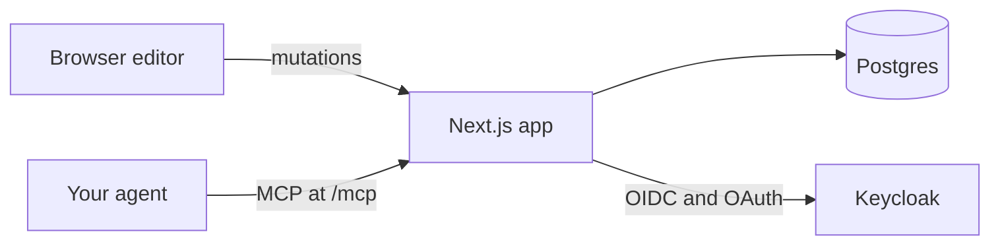

```
███████╗██╗     ██╗██████╗ ███████╗
██╔════╝██║     ██║██╔══██╗██╔════╝
███████╗██║     ██║██║  ██║█████╗
╚════██║██║     ██║██║  ██║██╔══╝
███████║███████╗██║██████╔╝███████╗
╚══════╝╚══════╝╚═╝╚═════╝ ╚══════╝
```

# slide

> Lab decks in the browser: draw, point at a shape, and let your agent edit it over MCP.

`slides` · `mcp` · `docker` · `pptx`

[](https://github.com/zyx1121/slide.winlab.tw/actions) &nbsp;[](https://github.com/zyx1121/slide.winlab.tw/pkgs/container/slide.winlab.tw) &nbsp;[](#license)

WinLab members draw their slides by hand in PowerPoint: rounded rectangles, connectors glued to them, text boxes placed wherever they fit. Asking an AI to change one box means first describing where that box is. slide keeps those drawing tools in the browser, lets you select a shape and tell your agent what to change, and still exports a normal `.pptx` when someone needs one.

> [!IMPORTANT]
> Status: the editor, `.pptx` import and export, publishing and the rule check work today. The MCP endpoint for agents, and suggestions with version history, are next; the plan is in [PLAN.md](PLAN.md).

## What it does

- **Draws** rectangles, rounded rectangles, ellipses, text boxes, pictures, and connectors that stay glued when shapes move, with undo, copy and paste
- **Types** in place, Chinese input methods included, wrapping lines exactly where PowerPoint does
- **Imports and exports** `.pptx`, keeping shapes native, connectors glued and text editable
- **Publishes** a deck to a read-only link anyone can open and download
- **Checks** a deck against the lab's slide rules: sizes, palette, overflow, overlaps, contrast
- **Next**: shows your agent what you selected and lets it edit over MCP, as suggestions you accept or revert

## Deploy

With Docker Compose, on any machine with Docker:

```sh
curl -fsSLO https://raw.githubusercontent.com/zyx1121/slide.winlab.tw/main/compose.yaml
curl -fsSL -o .env https://raw.githubusercontent.com/zyx1121/slide.winlab.tw/main/.env.example
# set POSTGRES_PASSWORD, APP_URL, KEYCLOAK_* and SESSION_SECRET in .env,
# and SLIDE_VERSION=main until v0.1.0 is released
docker compose up -d
```

This starts Postgres, a one-shot migration job and the web app, all from `ghcr.io/zyx1121/slide.winlab.tw`, with the app on `127.0.0.1:3000`. Uploaded pictures live on the `assets` volume; back it up with the database.

> [!IMPORTANT]
> The app listens on 127.0.0.1 and speaks plain HTTP: put a reverse proxy with TLS in front (it must pass the original `Host`), and register `APP_URL/*` as a redirect URI of your Keycloak client.

## Use

1. Sign in with your Keycloak account. The home page lists your decks: **新增** starts one from the WinLab template, **匯入** turns a `.pptx` into one.
2. Edit on the slide. Double-click a shape or the title to type; the dock at the bottom inserts shapes, text boxes, pictures and connectors and styles what you select; the check mark shows the rule check.
3. Download a `.pptx` from the dock, or publish the deck from the globe button and share its `/s/…` link.

## Configure

Set these in `.env`; [.env.example](.env.example) documents every one.

| Key                        | What it sets                                                | Default             |
| -------------------------- | ----------------------------------------------------------- | ------------------- |
| `POSTGRES_PASSWORD`        | the bundled Postgres password                               | required            |
| `APP_URL`                  | the public URL members open; Keycloak sends them back there | required            |
| `KEYCLOAK_ISSUER`          | your realm, e.g. `https://auth.example.org/realms/lab`      | required            |
| `KEYCLOAK_CLIENT_ID`       | a confidential client with the standard flow and PKCE S256  | required            |
| `KEYCLOAK_CLIENT_SECRET`   | that client's secret                                        | required            |
| `SESSION_SECRET`           | encrypts the session cookie, 32 characters or more          | required            |
| `SLIDE_VERSION`            | the image tag compose runs                                  | `latest`            |
| `SLIDE_BIND`, `SLIDE_PORT` | where the web port is published                             | `127.0.0.1`, `3000` |

## How it works



One Next.js app and one Postgres database, run with Docker Compose. Every edit, from the editor or from an agent, goes through the same validated path and is stored as a revision. Members sign in with Keycloak, and each member sees only their own decks and pictures; a published deck is readable by anyone with its link until it is unpublished. One renderer draws slides in the browser and, through resvg, on the server, with bundled fonts, so lines wrap the same everywhere.

## Develop

```sh
bun install
sh scripts/fetch-fonts.sh   # Carlito, Noto Sans TC and Noto Emoji, for slide rendering
cp .env.example .env   # set DATABASE_URL to a Postgres you can reach
bun run migrate
bun dev
```

CI runs `bun run typecheck`, `bun run lint`, `bun run format:check`, and `bun run test`, then builds the image and smoke-tests the compose stack with [scripts/smoke.sh](scripts/smoke.sh).

## Limitations

- Slides use the WinLab master; an imported deck keeps its shapes, not its own master
- Import leaves out tables, charts, SmartArt, freeforms, and pictures in EMF, SVG or TIFF, and says so
- Pictures are PNG, JPEG or GIF, up to 10 MB and 50 million pixels
- Text is capped at 5,000 characters a shape and 20,000 a slide, so any slide renders in a second or two
- Decks are private to their owner; sharing with other members is not there yet

## Contributing

Issues and PRs welcome: start with [CONTRIBUTING.md](https://github.com/zyx1121/.github/blob/main/CONTRIBUTING.md).

## License

[MIT](LICENSE) · every connector stays glued
